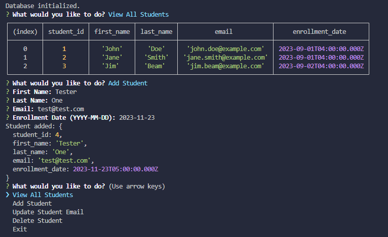

# COMP3005 - A4(1) - Database Interaction with PostgreSQL and Application Programming

Daniel Vlassov
SID: 101222428

Video URL: https://youtu.be/vkXRnpmnCbE

# Requirements

- PostgreSQL: https://www.postgresql.org/download/
- Node/NPM: https://nodejs.org/en/download (I'm using 18)

## How to run

- cd into this folder
- run `npm i`
- run `node cli.js`

## Functions
- initializeDatabase() -> Drops existing table if exists (for testing), then populates the students table WITH DQL/DLL in the DB
- getAllStudents() -> Displays all student records from the DB
- addStudent(answers) -> Adds a new student to the database from CLI prompts 
- updateStudentEmail(answers) -> Updates the email of a student based on their ID (As per spec, graceful error when duplicate)
- deleteStudent(answers) -> Removes a student from the database using their ID (As per spec, graceful error when ID not found)
- main() -> CLI flow

